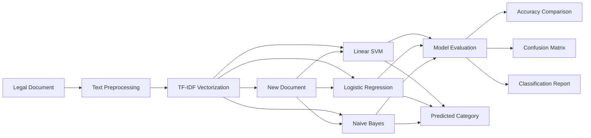

# Legal Document Category Classification

### TF-IDF + Linear SVM + Logistic Regression + Naive Bayes

An interactive Natural Language Processing (NLP) and Machine Learning application for automatically classifying legal documents into different categories.

The project provides a Streamlit web interface where users can upload a legal-document dataset, train multiple machine-learning models, compare their performance, visualize results, and classify new legal documents.

---

## Live Demo

Streamlit Application:
https://legaldocumentclassification.streamlit.app/

## GitHub Repository

Source Code:
https://github.com/Abhishek-pandre-coder/legal_classification_document_category.git

---

## Features

* Upload legal document CSV files
* Dataset overview and category distribution
* Text data preprocessing
* TF-IDF text vectorization
* Linear SVM classification
* Logistic Regression classification
* Multinomial Naive Bayes classification
* Model accuracy comparison
* Classification reports
* Confusion matrix visualization
* Real-time legal document prediction
* Interactive Streamlit interface

---

## Project Workflow



---

## Machine Learning Pipeline

```text
Legal Document
       |
       v
Data Cleaning
       |
       v
TF-IDF Feature Extraction
       |
       v
+-----------------------------+
|     Machine Learning        |
+-----------------------------+
| Linear SVM                  |
| Logistic Regression         |
| Multinomial Naive Bayes     |
+-----------------------------+
       |
       v
Model Evaluation
       |
       v
Legal Document Category
```

---

## Technologies Used

| Technology          | Purpose                   |
| ------------------- | ------------------------- |
| Python              | Application development   |
| Pandas              | Dataset processing        |
| Scikit-learn        | Machine learning          |
| TF-IDF              | Text feature extraction   |
| Linear SVM          | Classification            |
| Logistic Regression | Classification            |
| Naive Bayes         | Classification            |
| Matplotlib          | Data visualization        |
| Seaborn             | Statistical visualization |
| Streamlit           | Web application           |

---

## Project Structure

```text
legal_classification_document_category/
|
├── legal_document_classification.py
├── legal_documents_240_mixed.csv
├── requirements.txt
├── project report.pdf
├── Legal_Document_Classification_10_Slides_Same_Template.pptx
├── PPT format.pptx
└── README.md
```

---

## Dataset

The project uses:

`legal_documents_240_mixed.csv`

The dataset contains legal document text and corresponding document categories.

The application expects important columns such as:

```text
text
category
```

The Streamlit application also allows the user to select the text and category columns from the uploaded dataset.

---

## Machine Learning Models

### 1. Linear SVM

Linear Support Vector Machine is used to classify TF-IDF-transformed legal documents into their respective categories.

### 2. Logistic Regression

Logistic Regression is used as a second classification model for comparing prediction performance.

### 3. Multinomial Naive Bayes

Multinomial Naive Bayes is suitable for text classification and is used as another comparative model.

---

## TF-IDF

The project uses Term Frequency-Inverse Document Frequency (TF-IDF) to convert legal-document text into numerical features.

The implementation uses:

```python
TfidfVectorizer(
    lowercase=True,
    stop_words="english",
    max_features=20000,
    ngram_range=(1, 2),
    sublinear_tf=True
)
```

This enables the machine-learning algorithms to process textual legal documents numerically.

---

## Model Evaluation

The application evaluates the three models using:

* Accuracy
* Classification Report
* Confusion Matrix
* Accuracy Comparison Chart

The application dynamically calculates the accuracy based on the selected dataset and train-test split.

---

## Document Prediction

Users can paste new legal-document text into the Streamlit application.

The application sends the text through the TF-IDF vectorizer and generates predictions using:

```text
Linear SVM
      |
      v
Logistic Regression
      |
      v
Naive Bayes
      |
      v
Predicted Legal Category
```

The results from all three algorithms are displayed in the Streamlit interface.

---

## How to Run Locally

### Step 1: Clone the repository

```bash
git clone https://github.com/Abhishek-pandre-coder/legal_classification_document_category.git
```

### Step 2: Open the project

```bash
cd legal_classification_document_category
```

### Step 3: Install dependencies

```bash
pip install -r requirements.txt
```

### Step 4: Run Streamlit

```bash
streamlit run legal_document_classification.py
```

### Step 5: Open the application

Streamlit will provide a local URL such as:

```text
http://localhost:8501
```

---

## Project Objectives

* Automate legal document categorization.
* Apply NLP techniques to legal text.
* Convert textual data into numerical features using TF-IDF.
* Compare multiple machine-learning classification algorithms.
* Visualize model performance.
* Provide an easy-to-use web interface for document prediction.

---

## Project Highlights

```text
Legal Documents
       |
       v
Preprocessing
       |
       v
TF-IDF
       |
       v
Three Classification Models
       |
       v
Performance Analysis
       |
       v
New Document Prediction
       |
       v
Legal Category
```

---

## Developer

**Abhishek Krashna Pandre**

B.Tech – Information Technology
Rai Technology University, Bengaluru

---

## Project Links

GitHub Repository:
https://github.com/Abhishek-pandre-coder/legal_classification_document_category.git

Live Streamlit Application:
https://legaldocumentclassification.streamlit.app/

---

## Project

If you find this project useful, consider giving the repository a star on GitHub.
